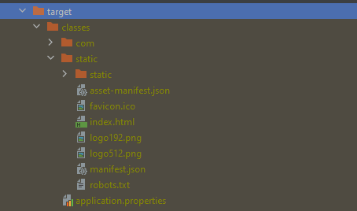

# demo
# full stack java project

#for maven build (frontend + backend)
1. ./mvnw clean (removes target folder)
2. ./mvnw clean install (builds the project based on pom.xml that we have configured to move react project into target static folder)

3. to test, go to target folder, run java -jar demo-snapshot.jar
